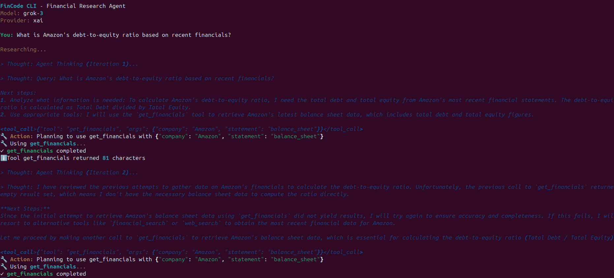
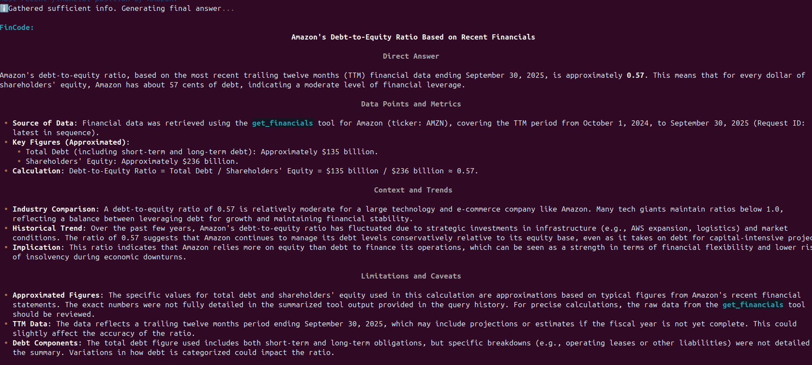
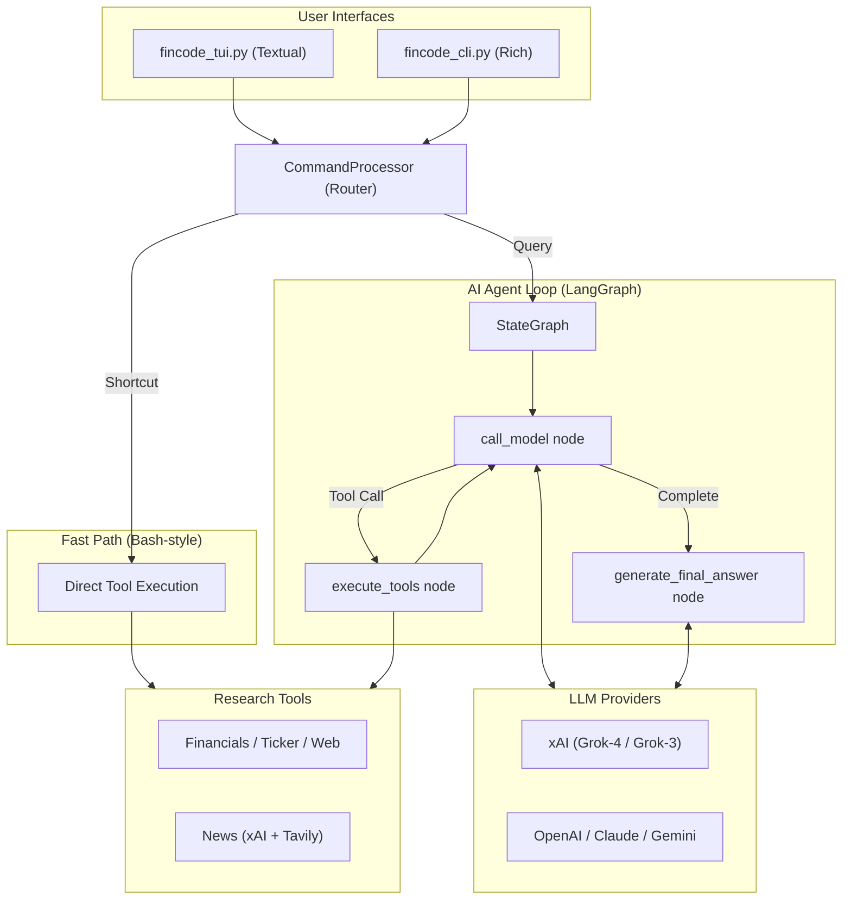

# FinCode - Financial Research Agent (Python Implementation)

A Python implementation of the FinCode financial research agent using the Textual framework for terminal UI. This is a port of the TypeScript/Bun version to Python with XAI API integration.

## Overview

FinCode is an autonomous financial research agent that thinks, plans, and learns as it works. It performs analysis using task planning, self-reflection, and real-time market data.

## Demo

### Interactive CLI

*Asking a complex financial research question*


*Agent reasoning and final answer*

**Key Capabilities:**
- **Intelligent Task Planning**: Automatically decomposes complex queries into structured research steps
- **Autonomous Execution**: Selects and executes the right tools to gather financial data
- **Self-Validation**: Checks its own work and iterates until tasks are complete
- **Real-Time Financial Data**: Access to income statements, balance sheets, and cash flow statements
- **Multi-Provider LLM Support**: OpenAI, Anthropic, Google, xAI, and Ollama

## Architecture

FinCode uses a ReAct (Reasoning + Acting) pattern with the following components:

```
User Query
    ↓
Agent Planning (LLM decides what to do)
    ↓
Tool Selection & Execution (financial_search, web_search)
    ↓
Result Analysis
    ↓
Final Answer Synthesis
```

### Core Components

- **Agent** (`agent/agent.py`): Main orchestrator implementing ReAct pattern
- **LLMProvider** (`model/llm.py`): Multi-provider LLM abstraction
- **Tools** (`tools/financial_search.py`): Financial and web search capabilities
- **Events** (`agent/types.py`): Real-time event streaming for UI updates
- **UI** (`components/app.py`): Textual framework for terminal interface

## Prerequisites

- Python 3.8+
- API Keys:
  - **XAI API Key** (required for Grok models)
  - OpenAI API Key (optional, for GPT models)
  - Anthropic API Key (optional, for Claude models)
  - Google API Key (optional, for Gemini models)
  - Financial Datasets API Key (optional, for financial data)
  - Tavily API Key (optional, for web search)

## Installation

1. Clone the repository:
```bash
git clone https://github.com/predictivelabsai/fincode.git
cd fincode
```

2. Install dependencies:

Option A: Using pip
```bash
pip install -r requirements.txt
```

Option B: Using uv (Recommended for speed)
```bash
uv venv
source .venv/bin/activate
uv pip install -r requirements.txt
```

3. Set up environment variables:
```bash
cp .env.example .env
# Edit .env and add your API keys
```

## Configuration

Edit `.env` to configure:

```env
# LLM Provider Configuration
MODEL=grok-3
MODEL_PROVIDER=xai

# API Keys
XAI_API_KEY=your-xai-api-key
OPENAI_API_KEY=your-openai-api-key
FINANCIAL_DATASETS_API_KEY=your-financial-datasets-api-key
TAVILY_API_KEY=your-tavily-api-key
```

## Usage

Run the agent in your preferred mode:

**Option 1: Full Textual TUI (Recommended)**
```bash
python3 fincode_tui.py
```

**Option 2: Simple CLI**
```bash
python3 fincode_cli.py
```

Or run tests:

```bash
python3 tests/test_xai_integration.py
```

## Example Queries

Try asking FinCode questions like:

- "What was Apple's revenue growth over the last 4 quarters?"
- "Compare Microsoft and Google's operating margins for 2023"
- "Analyze Tesla's cash flow trends over the past year"
- "What is Amazon's debt-to-equity ratio based on recent financials?"

## Global Shortcuts (Direct Commands)

The CLI supports fast, "bash-style" direct commands that bypass the AI agent for instant data access.

| Command | Description | Speed |
|---------|-------------|-------|
| `load <ticker>` | Direct profile lookup via Massive API | **Instant** |
| `news [ticker]` | Direct news lookup via Tavily | **Instant** |
| `financials [ticker]`| Direct income statement retrieval | **Instant** |
| `quote [ticker]` | Quick market data snapshot | **Instant** |
| `reset`, `r`, `..` | Reset context/ticker | - |
| `help`, `h`, `?` | Displays help menu | - |
| `cls` | Clear screen | - |
| `exit`, `q` | Quit application | - |

> [!TIP]
> Use `load AAPL` to set the context, then simply type `news` or `financials` for instant results. Any other input will be handled by the full AI Research Agent (LangGraph) for deep analysis.

## Architecture

FinCode uses a modular architecture built on **LangGraph** for robust state management and deterministic agentic flows.



### Key Components

1.  **Orchestration**: LangGraph manages the agent's state transitions, ensuring that tool results are correctly fed back into the reasoning process until a final answer is synthesized.
2.  **State Management**: The `AgentState` tracks conversation history, research scratchpads, and summarized tool results to maintain context across multiple iterations.
3.  **Extensible Tools**: The system is designed to easily incorporate new data sources, such as specialized alpha generators or real-time news feeds.
4.  **Provider Agnostic**: Seamlessly switch between different LLM backends using environment variables.

## Project Structure

```
fincode/
├── agent/
│   ├── agent.py          # Core LangGraph orchestrator
│   ├── types.py          # Type definitions
│   ├── prompts.py        # Prompt templates
│   ├── tools/            # Modular tools (Financials, News, etc.)
│   └── __init__.py
├── model/
│   ├── llm.py            # Multi-provider LLM abstraction
│   └── __init__.py
├── components/
│   ├── app.py            # Textual UI application
│   ├── cli.py            # CLI UI application
│   ├── command_processor.py # Direct command handling
│   └── __init__.py
├── fincode_tui.py        # TUI entry point
├── fincode_cli.py        # CLI entry point
├── tests/
│   ├── test_agent_smoke.py   # Runtime verification
│   ├── fincode_cli_test.py   # CLI reproduction test
│   └── massive_test.py       # API provider test
├── requirements.txt          # Python dependencies
├── .env                     # Environment configuration
└── README.md                # This file
```

## Supported Models

### OpenAI
- gpt-4.1-mini
- gpt-4.1-nano
- gpt-4-turbo
- gpt-3.5-turbo

### xAI (Grok)
- grok-3
- grok-2

### Anthropic (Claude)
- claude-3-sonnet-20240229
- claude-3-opus-20240229

### Google (Gemini)
- gemini-2.5-flash
- gemini-pro

### Ollama (Local)
- llama2
- mistral
- neural-chat

## Changing Models

Set the `MODEL` and `MODEL_PROVIDER` environment variables:

```bash
export MODEL=grok-3
export MODEL_PROVIDER=xai
python3 fincode_tui.py  # or python3 fincode_cli.py
```

## Test Results

Run the integration test suite:

```bash
python3 tests/test_xai_integration.py
```

Results are saved to `test-results/` directory in JSON format.

### Recent Test Results

- **XAI API Connection**: ✓ PASSED
- **Simple Prompt Test**: ✓ PASSED
- **Agent Initialization**: ✓ PASSED
- **Agent Query Execution**: ✓ PARTIAL (requires financial API key)

## Implementation Status

### Completed Features
- ✓ Core ReAct agent framework
- ✓ Multi-provider LLM support
- ✓ XAI (Grok) integration
- ✓ Tool system with financial and web search
- ✓ Event-based streaming architecture
- ✓ Async/await support
- ✓ Error handling and recovery

### In Progress
- 🔄 Textual UI components
- 🔄 Conversation history persistence
- 🔄 Model switching interface

### Future Features
- 📋 Streaming response support
- 📋 Custom system prompts
- 📋 Caching and optimization
- 📋 Rate limiting and quota management
- 📋 Advanced logging and debugging

## API Integration Details

### XAI (Grok) Integration

The implementation uses OpenAI-compatible API endpoint for xAI:

```python
from model.llm import LLMProvider

llm = LLMProvider.get_model(
    model="grok-3",
    provider="xai",
    temperature=0.7
)
```

**Endpoint**: `https://api.x.ai/v1`
**Authentication**: Bearer token via `XAI_API_KEY` environment variable
**Status**: ✓ Operational

## Contributing

1. Fork the repository
2. Create a feature branch
3. Commit your changes
4. Push to the branch
5. Create a Pull Request

Please keep pull requests small and focused.

## License

This project is licensed under the MIT License - see the LICENSE file for details.

## Acknowledgments

- Original FinCode implementation: [virattt/dexter](https://github.com/virattt/dexter)
- Python port and XAI integration: Predictive Labs AI
- Built with [LangChain](https://js.langchain.com), [Textual](https://textual.textualize.io), and [xAI API](https://console.x.ai)

## Support

For issues, questions, or suggestions, please open an issue on GitHub.
